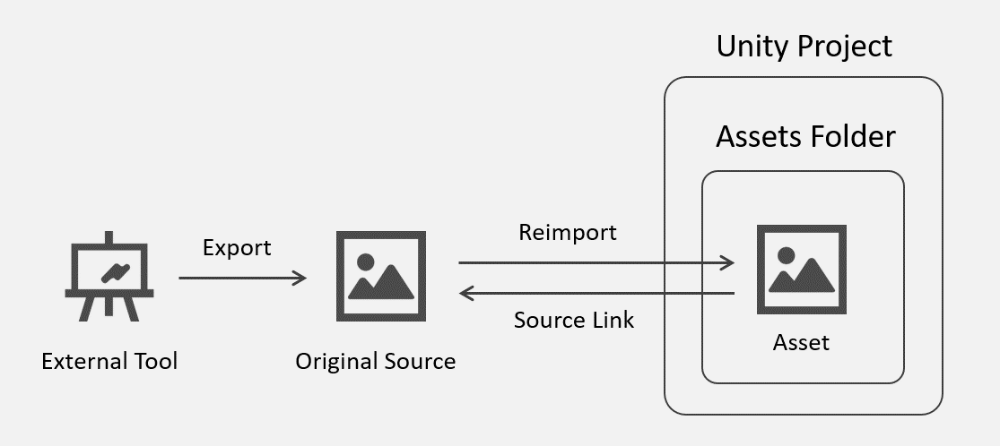
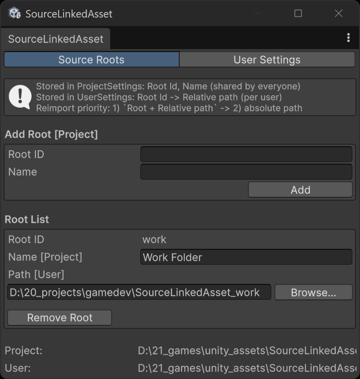
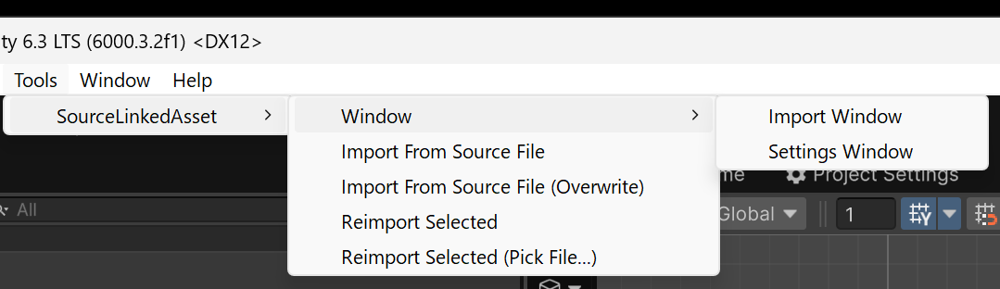
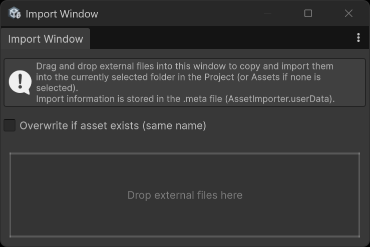
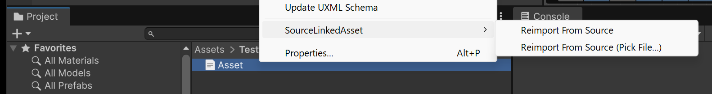
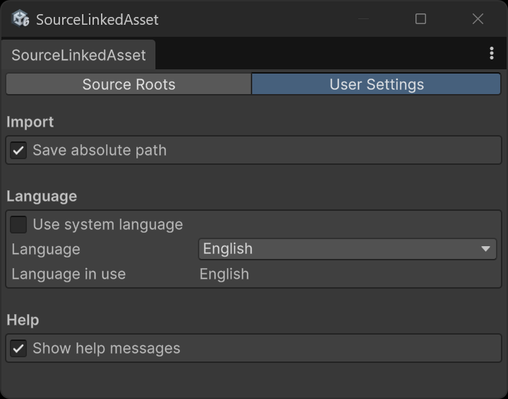

Source Linked Asset

# 概要

Source Linked Asset は、  
Unity 外部で作成・編集されたファイルと Unity アセットを紐づけ、  
再インポートをワンクリックで行うための Editor 拡張です。

外部ツールで作成・編集されているファイルを「オリジナル」として扱い、  
Unity 内のアセットはそのコピーとして管理します。



## 特徴

- Unity外部で作成・編集されるファイルを前提としたワークフロー
- Unity内のアセットは、外部ファイルから生成された「コピー」として扱う
- オリジナルファイルとアセットの対応関係を `.meta` ファイルに明示的に記録
- ファイルの手動コピーに頼らず、オリジナルからワンクリックで再インポートできる

## 注意事項

- 本ツールは個人開発・小規模チーム向けです。
- Unityのアップデートで動作しなくなる可能性があります。

- 本ツールは外部にあるソースを編集するワークフローを前提としています。
- Unity内のアセットは外部ソースで上書きされます。
- **Assets フォルダー内を作業場所として使用しないでください。**

## 想定ユーザー

- 音声 / 画像編集ツールなどでの編集を、Unity のプロジェクトフォルダの外で行いたい開発者
- 個人開発者・小規模チーム
  - オリジナルファイルを編集する人が固定されている
  - Unity 外の作業フォルダ構成（相対パス）を揃えられる規模

オリジナルファイルを複数人が同時に編集するような大規模チームでの運用は想定していません。

---

# 目次

- [概要](#概要)
  - [特徴](#特徴)
  - [注意事項](#注意事項)
  - [想定ユーザー](#想定ユーザー)
- [目次](#目次)
- [インストール方法](#インストール方法)
- [動作の仕組み](#動作の仕組み)
  - [オリジナルのパスはどのような形で保存されている？](#オリジナルのパスはどのような形で保存されている)
    - [ソースルートの保存先](#ソースルートの保存先)
    - [例](#例)
    - [アセット側の保存先](#アセット側の保存先)
- [基本ワークフロー](#基本ワークフロー)
  - [初回インポート](#初回インポート)
    - [1. ソースルートを設定](#1-ソースルートを設定)
    - [2. 外部ファイル（ソース）を Unity にインポート（初回）](#2-外部ファイルソースを-unity-にインポート初回)
      - [Toolsメニュー](#toolsメニュー)
      - [ドラッグアンドドロップ (Import Window)](#ドラッグアンドドロップ-import-window)
  - [通常運用](#通常運用)
    - [1. 外部ツール側でオリジナルのソースファイルを更新する](#1-外部ツール側でオリジナルのソースファイルを更新する)
    - [2. Unity Editor 上で対応するアセットに対して Reimport を実行する](#2-unity-editor-上で対応するアセットに対して-reimport-を実行する)
      - [アセットを右クリックしてメニューを選択](#アセットを右クリックしてメニューを選択)
      - [Inspectorに表示されたボタン](#inspectorに表示されたボタン)
      - [Toolsのメニュー](#toolsのメニュー)
- [再インポートのロジック](#再インポートのロジック)
  - [Reimport と Relink](#reimport-と-relink)
- [保存される設定データ](#保存される設定データ)
  - [ユーザー設定ウィンドウ](#ユーザー設定ウィンドウ)

---

# インストール方法

本ツールは Unity Package Manager（UPM）経由で導入します。

1. Unity Editor を開く
2. Package Manager を開く
3. 「Add package from git URL...」を選択
4. 以下の URL を指定する

```
https://github.com/masatoko/SourceLinkedAsset.git?path=/Packages/com.tenkaigames.source-linked-asset
```

---

# 動作の仕組み

- 初回インポート時に、アセット側の `.meta` ファイルへオリジナルのパス情報を保存
- 再インポート時に、`.meta` の情報をもとにオリジナルを特定し、コピーしてアセットを上書き

## オリジナルのパスはどのような形で保存されている？

オリジナルファイルのパスは  
**作業フォルダのルートへの絶対パス** と **ファイルへの相対パス** に分けて保存されています。  

これは、Unity 外にある作業フォルダの場所が変わっても動作するようにするためです。

加えて、**オリジナルファイルへの絶対パス** も保険として保存されています。

これ以降、作業フォルダのルートを、**ソースルート** と呼びます。

再インポート時には、

- ソースルート + 相対パス  
- （見つからない場合のフォールバックとして）絶対パス  

の順でオリジナルファイルを探索します。

これにより、作業フォルダの場所が変わっても、  
ソースルートの設定を更新するだけでリンクを維持でき、  
同時に、最低限の復旧手段として絶対パスも利用できます。

### ソースルートの保存先

ソースルートの情報は、PC環境ごとに共通か・異なるか、という基準で分けて保存されています。

- プロジェクト設定  
  - `ソースルートID` と `表示名`  
  - 環境が異なっても共通

- ユーザー設定  
  - `ソースルートID` と `実際のディレクトリパス`  
  - 環境ごとに設定可能

これにより、PC環境ごとにソースルートは異なるディレクトリパスを持つことができます。

### 例

オリジナルファイルのパスが以下の場合：

```
C:/foo/ProjectABC/bar/source.png
```

このとき、保存される情報は次のようになります。

- ソースルート  
  - ID: project-abc  
  - パス: C:/foo/ProjectABC/

- 相対パス  
  - bar/source.png

アセット側には、  
「project-abc + bar/source.png」という形でリンク情報が保存されます。

### アセット側の保存先

アセット側のパスの保存先は、アセットごとに存在するメタファイル（.meta）です。

```meta
fileFormatVersion: 2
guid: 329350b281b02f240976efb3516f24b1
TextScriptImporter:
  externalObjects: {}
  userData: '{ "tenkai.sourceLinkedAsset":
                { "assetSourceLink":
                  { "version":1,
                    "sourceAbs":"C:/foo/ProjectABS/bar/source.png",
                    "sourceRootId":"project-abc",
                    "sourceRel":"bar/source.png",
                    "sourceLastWriteUtc":639063063166477041,
                    "sourceSizeBytes":5678,
                    "sourceSha256":"ed7002b439e9ac845f22357d822bac1444730fbdb6016d3ec9432297b9ec9f73",
                    "assetPathAtImport":"Assets/MyGameProject/source.png"}}}'
  assetBundleName: 
  assetBundleVariant: 
```

---

# 基本ワークフロー

## 初回インポート

### 1. ソースルートを設定

Tools -> SourceLinkedAsset -> Window -> Settings Window -> Source Roots タブ

- `Source Roots` タブ
- Root ID, Name を入力して `Add`
- ファイルピッカーが開くのでソースルートを選択



### 2. 外部ファイル（ソース）を Unity にインポート（初回）

初回インポートの手段は２つあります。
- Toolsメニュー
- ドラッグアンドドロップ (Import Window)

#### Toolsメニュー

Tools メニューから各種インポート操作を実行できます。

- Import From Source
- Import From Source (Overwrite)

`Overwrite` が付いたメニューでは、同名のアセットが既に存在する場合に上書きされます。  
付いていないメニューでは、新しいアセット名でインポートされます。



#### ドラッグアンドドロップ (Import Window)

Tools -> SourceLinkedAsset -> Window -> Import Window でウィンドウを開きます。

外部ファイルをドラッグ＆ドロップでインポートできます。

ドロップしたファイルは、  
Unity のプロジェクトウィンドウで現在開いているフォルダにインポートされます。



## 通常運用

### 1. 外部ツール側でオリジナルのソースファイルを更新する

Unity外にあるオリジナルのソースファイルを更新します。
次に、このファイルをUnityのアセットに上書きしてReimportします。

### 2. Unity Editor 上で対応するアセットに対して Reimport を実行する

オリジナルの再インポートの手段は３つあります。

#### アセットを右クリックしてメニューを選択

アセットを右クリックし、`Reimport From Source` を選択すると、  
リンクされているオリジナルファイルをUnityのアセットに上書きコピーして再インポートが行われます。



#### Inspectorに表示されたボタン

Inspector の下部には、アセットに紐づくオリジナルファイルの情報が表示されます。

- Reimport: 再インポートを実行します。　　
- Reveal: オリジナルファイルが置かれているフォルダを直接開くことができます。　　
- [Relink](#reimport-と-relink): アセットに紐づいたオリジナルを変更します。　　
- Copy Path: オリジナルのファイルパスをクリップボードにコピーします。　　


#### Toolsのメニュー

アセットを選択してから

- Reimport Selected
- Reimport Selected (Pick File...) <- これは [Relink](#reimport-と-relink)


---

# 再インポートのロジック

- パスの解決
  - metaファイル内の `ソースルート + 相対パス` からオリジナルソースを探索
  - 見つからない場合、metaファイル内の `絶対パス` から探索
- オリジナルソースとアセットの内容を比較し、異なる場合にのみコピーと再インポートが行われる。

## Reimport と Relink

- Reimport:
  - 既にリンクされているオリジナルファイルをコピーし、Unity アセットを再インポートする操作。

- Relink:
  - アセットにリンクするオリジナルファイルを **選びなおして** 再インポートする操作。ソースファイルの移動や構成変更後の復旧に使用します。

---

# 保存される設定データ

- ProjectSettings
  - ソースルート定義（RootId, 表示名）
  - プロジェクト全体で共有される
  - 保存先: `ProjectSettings/SourceLinkedAsset.json`
  - バージョン管理対象

- UserSettings
  - RootId -> 実際のディレクトリパスの対応
  - ユーザーごとのローカル設定
  - 保存先: `UserSettings/SourceLinkedAsset.json`
  - バージョン管理対象外（Git管理の場合 `.gitignore` に含めること）

- 各アセット の meta ファイル
  - 外部ソースのパス情報（ソースルートID・相対パス）
  - 同期状態判定用のメタデータ（更新日時・サイズ・ハッシュなど）
  - 保存先: アセットの `.meta` ファイル内の `AssetImporter.userData`

- EditorPrefs
  - Inspectorに表示される情報の折り畳み状態

## ユーザー設定ウィンドウ

Tools -> SourceLinkedAsset -> Window -> Settings Window -> User Settings タブ


